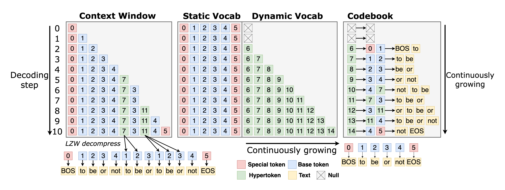

# zip2zip




##  Dependencies

Create a new conda environment with the following command:

```batch
conda create -n ozz python=3.10
conda activate ozz
```

Then install the required packages with the following command:

```batch
pip install -r requirements.txt
```

To use this project, you need to compile the fast_compression library (which is written in rust).

```batch
pip install maturin
cd fast_compression
maturin develop --release
```

## Run a Pretrained zip2zip model

```batch
python example/run_generate.py --adapter=checkpoints/wEtm/model_24000.safetensors  --prompt="Expliquez-moi l'histoire de la Tour Eiffel"  --max-tokens=350  --chat
```

## Data Preparation

To train or adapt a zip2zip model, we need to train the model on a dataset aligned with lzw compression.
Given a corpus dataset hosted on Hugging Face hub, we provide a `data` module to prepare the dataset for training.

The script `data.py` will run `batching` , `LZW compression`, `collation`, `sharding` and finally save the prepared dataset to disk as `safetensors` files.

The configuration file `config.yaml` contains the parameters for the data preparation, including the dataset name, the target size of the dataset, the sequence length etc.

```batch
python3 -m data --config="config.yaml" --split="train" --num-tokens=100_000 --batch-size=100
```

## Train

To adapt an existing LLM as a zip2zip model, we can simply run the training script.
The `config.yaml` file contains the parameters for the training, including the base LLM model, the hyper-encoder architecture, the training settings such as learning rate, batch size, etc.

```batch
torchrun --standalone --nproc_per_node=4 -m train --config="config.yaml"
```

The script and config files to retrain the models in the paper are provided in the `reproducibility` folder.

## Evaluation

All the evaluation scripts to reproduce the results in the paper are provided in the `reproducibility` folder.

### Eval Token Efficiency

`python example/compute_token_efficiency.py`

Expected output:

```
                   code  math  chat  multilingual  knowledge
Llama-32K          2.90  2.62  4.04          3.42       4.06
Llama-32K-LZW      5.27  3.93  5.43          4.15       4.97
Llama-128K         3.94  2.88  4.84          3.86       4.76
Llama-128K-LZW     6.46  4.16  6.21          4.54       5.60
Phi-200K           3.90  2.88  5.09          4.54       4.81
Phi-200K-LZW       6.42  4.17  6.44          5.25       5.64
Gemma-256K         3.35  2.79  4.77          4.46       4.69
Gemma-256K-LZW     5.91  4.12  6.21          5.23       5.63
Qwen-150K          3.83  2.77  4.83          3.84       4.68
Qwen-150K-LZW      6.35  4.08  6.22          4.54       5.55
DeepSeek-128K      3.66  3.01  4.83          3.95       4.79
DeepSeek-128K-LZW  6.10  4.29  6.21          4.64       5.63
```

### Eval Perplexity

```bash
python eval.py --adapter=checkpoints/evqn/model_7000.safetensors  --tasks wikitext,pile_10k,paloma_mc4,paloma_c4_100_domains --limit 500 --max-context-length 1024
```

```
|    Tasks     |Version|Filter|n-shot|    Metric     |   | Value |   |Stderr|
|--------------|------:|------|-----:|---------------|---|------:|---|------|
|C4 100 Domains|      1|none  |     2|bits_per_byte  |↓  | 0.8634|±  |   N/A|
|              |       |none  |     2|byte_perplexity|↓  | 1.8193|±  |   N/A|
|              |       |none  |     2|word_perplexity|↓  |38.6444|±  |   N/A|
|mC4           |      1|none  |     2|bits_per_byte  |↓  | 1.0019|±  |   N/A|
|              |       |none  |     2|byte_perplexity|↓  | 2.0026|±  |   N/A|
|              |       |none  |     2|word_perplexity|↓  |85.7885|±  |   N/A|
|pile_10k      |      1|none  |     2|bits_per_byte  |↓  | 0.9636|±  |   N/A|
|              |       |none  |     2|byte_perplexity|↓  | 1.9502|±  |   N/A|
|              |       |none  |     2|word_perplexity|↓  |94.4065|±  |   N/A|
|wikitext      |      2|none  |     2|bits_per_byte  |↓  | 0.7563|±  |   N/A|
|              |       |none  |     2|byte_perplexity|↓  | 1.6892|±  |   N/A|
|              |       |none  |     2|word_perplexity|↓  |16.4990|±  |   N/A|
```

### Eval NLP downstream tasks

```bash
python eval.py --adapter=checkpoints/evqn/model_7000.safetensors --tasks ai2_arc,openbookqa,piqa,winogrande,commonsense_qa,lambada,mathqa,hellaswag --limit 500
```


```
|     Tasks      |Version|Filter|n-shot|  Metric  |   | Value  |   |Stderr |
|----------------|-------|------|-----:|----------|---|-------:|---|------:|
|arc_challenge   |      1|none  |     2|acc       |↑  |  0.5550|±  | 0.0157|
|                |       |none  |     2|acc_norm  |↑  |  0.5580|±  | 0.0157|
|arc_easy        |      1|none  |     2|acc       |↑  |  0.8360|±  | 0.0117|
|                |       |none  |     2|acc_norm  |↑  |  0.8220|±  | 0.0121|
|commonsense_qa  |Yaml   |none  |     2|acc       |↑  |  0.4380|±  | 0.0157|
|hellaswag       |      1|none  |     2|acc       |↑  |  0.4880|±  | 0.0158|
|                |       |none  |     2|acc_norm  |↑  |  0.6110|±  | 0.0154|
|lambada_openai  |      1|none  |     2|acc       |↑  |  0.2180|±  | 0.0131|
|                |       |none  |     2|perplexity|↓  |200.9825|±  |26.5565|
|lambada_standard|      1|none  |     2|acc       |↑  |  0.1400|±  | 0.0110|
|                |       |none  |     2|perplexity|↓  |189.6279|±  |18.7384|
|mathqa          |      1|none  |     2|acc       |↑  |  0.3670|±  | 0.0152|
|                |       |none  |     2|acc_norm  |↑  |  0.3530|±  | 0.0151|
|openbookqa      |      1|none  |     2|acc       |↑  |  0.3380|±  | 0.0212|
|                |       |none  |     2|acc_norm  |↑  |  0.4580|±  | 0.0223|
|piqa            |      1|none  |     2|acc       |↑  |  0.7870|±  | 0.0130|
|                |       |none  |     2|acc_norm  |↑  |  0.8000|±  | 0.0127|
|winogrande      |      1|none  |     2|acc       |↑  |  0.7230|±  | 0.0142|
```

### Inference Latency

> [!WARNING]
> The fast inference implementation prioritizes speed over quality. Generation quality may be degraded compared to the original generation code, likely due to floating point precision differences that we are currently investigating. For best quality results, use the [original generation code](#run-a-pretrained-zip2zip-model) without fast inference optimizations.

#### PyTorch
To run the finetuned Phi-3.5-medium model, use the following command:
```bash
python -m inference.torch.generate --prompt-length=512
```
To run the original model, use the `--original` flag.

#### MLX
To run the finetuned Phi-3.5-mini model, use the following command:
```bash
python -m inference.mlx.generate --prompt-length=512
```
To run the original model, use the `--original` flag.

### Tokenization Throughput

```bash
python bench_tokenizers.py --model="microsoft/Phi-3.5-mini-instruct" --batch-sizes=1,10,50,100,150,200
```
